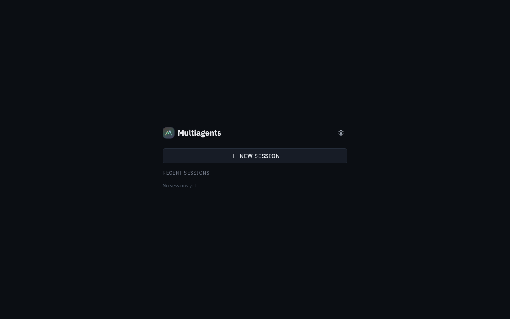
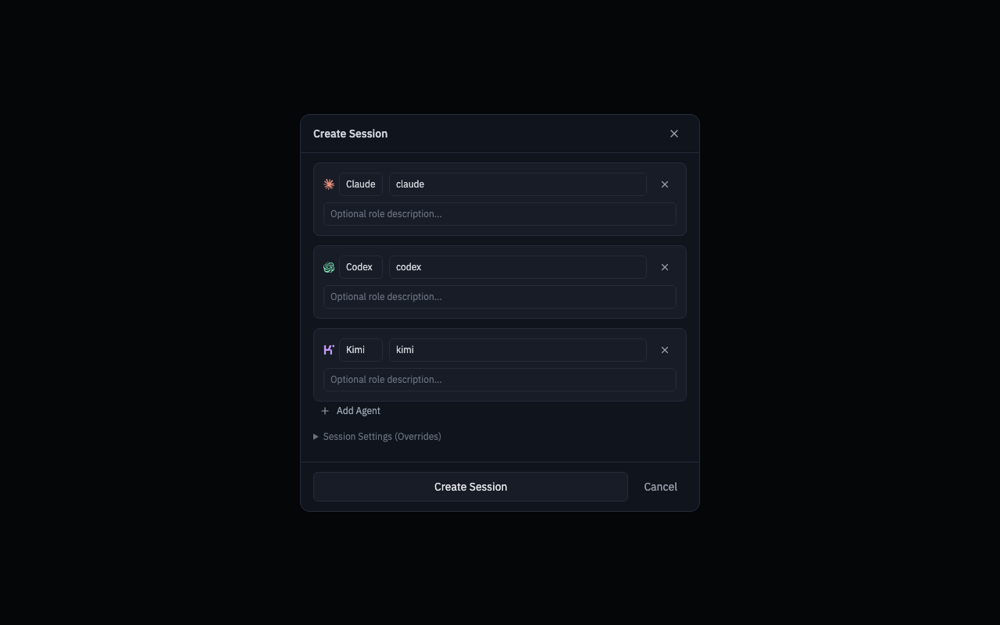
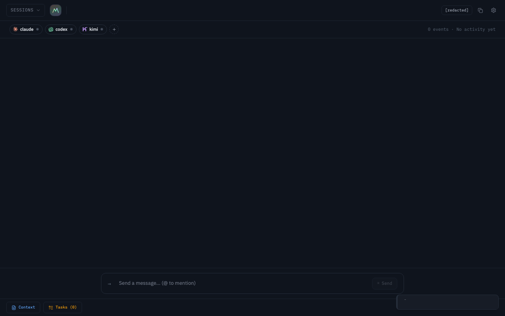
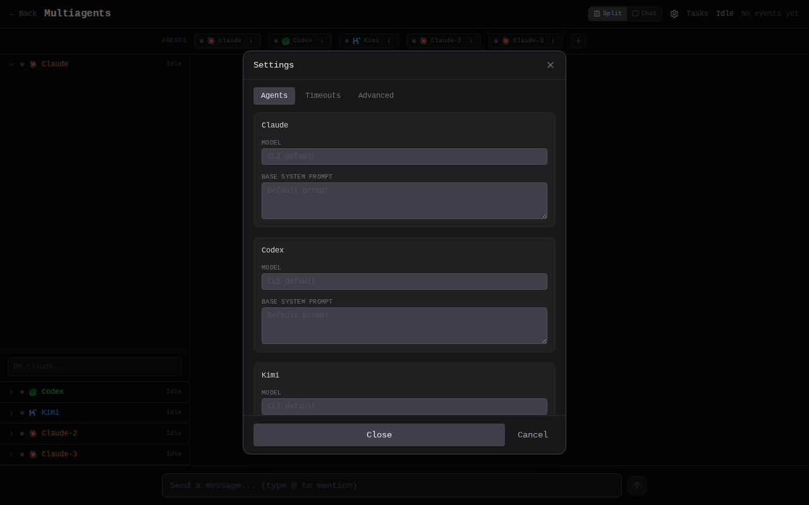

# Multiagents

Multi-agent AI orchestration platform. Run collaborative sessions with Claude, Codex, and Kimi — featuring event-driven messaging, round consensus with `[PASS]`, kanban task workflows, agent personas, cross-session memory, and real-time streaming.

## Features

- **Event-driven collaboration with rounds** — agents react to incoming events in real time; rounds close on settlement and advance after all agents return `[PASS]`
- **Kanban task workflows** — cards move through Backlog, Planning, Reviewing, Implementing, Done
- **Agent personas** — dynamic roles let you run multiple instances of the same model with different specializations
- **Direct messages** — message individual agents mid-discussion
- **Cross-session memory** — agent learning profiles persist and grow across sessions
- **Split layout** — agent raw streams | shared narrative | kanban board
- **Real-time streaming** — live output via WebSocket with tool badges and thinking blocks
- **Configurable settings** — models, system prompts, and timeouts adjustable from the UI
- **Session persistence** — SQLite-backed history with replay on reconnect
- **Pause/resume/cancel** — full control over ongoing discussions
- **Web-first client** — responsive browser UI for local development

## Quick Start

```bash
./setup.sh          # Install Python + Node dependencies
./start.sh --backend python   # Launch backend + frontend (http://localhost:5174)
```

Or manually:

```bash
pip install -e .                # Backend dependencies
cd web && pnpm install          # Frontend dependencies
./start.sh --backend python     # Run both
```

See the [Quickstart Tutorial](./docs/quickstart.md) for a guided walkthrough.

## UI Preview

Session picker:



Create session flow:



Main workspace:



Settings modal:



## Runtime Controls

- `Stop agent`: interrupt one agent's active turn.
- `Stop round`: interrupt all active turns in the current round.
- `Resume`: continue after a paused round.
- `Direct message`: send a targeted instruction to one agent.
  - If active, the agent is restarted with the DM.
  - If idle, the DM triggers a focused single-agent turn.

## Technology Stack

### Backend (Python)
- **Language**: Python 3.12+
- **Framework**: FastAPI with native WebSocket support
- **Server**: Uvicorn
- **Database**: SQLite with WAL mode (`~/.multiagents/multiagents.db`)
- **Build**: Hatchling

### Frontend
- **Language**: TypeScript ~5.9
- **Framework**: React 19
- **Build Tool**: Vite 7
- **Styling**: Tailwind CSS 4 with Typography plugin
- **Package Manager**: pnpm

## Project Structure

```
.
├── pyproject.toml              # Python project config & dependencies
├── setup.sh                    # One-command install script
├── start.sh                    # Full-stack dev launcher
├── scripts/
│   └── multiagents-cards       # Cards CLI utility
├── src/                        # Python backend source
│   ├── main.py                 # CLI entry point & server bootstrap
│   ├── agents/                 # AI agent integrations
│   │   ├── base.py             # Abstract base agent class
│   │   ├── persistent.py       # Long-lived subprocess management
│   │   ├── claude.py           # Claude Code CLI integration
│   │   ├── codex.py            # OpenAI Codex CLI integration
│   │   ├── kimi.py             # Kimi Code CLI integration
│   │   ├── prompts.py          # System prompts & persona templates
│   │   └── protocols/          # Protocol adapters (claude, codex, kimi)
│   ├── cards/                  # Kanban task engine
│   ├── chat/                   # Chat orchestration & round settlement
│   ├── memory/                 # Cross-session memory & learning
│   └── server/                 # FastAPI app, WebSocket, REST APIs
├── tests/                      # Test suite (pytest)
├── web/                        # Frontend application
│   ├── src/
│   │   ├── App.tsx             # Main app component
│   │   ├── types.ts            # TypeScript type definitions
│   │   ├── hooks/              # React hooks (useWebSocket, etc.)
│   │   ├── components/         # UI components
│   │   └── components/ui/      # Reusable component library
│   └── dist/                   # Built frontend assets
└── docs/                       # Documentation & images
```

## Commands

### Backend (Python)

```bash
pip install -e .                                  # Install dependencies
pip install -e ".[dev]"                           # Install with dev/test dependencies
python3 -m src.main                               # Run server (port 8421)
multiagents --agents claude,codex --port 8080     # Custom options
pytest                                            # Run all tests
pytest tests/test_room.py -k test_name            # Run single test
```

### Frontend

```bash
cd web && pnpm install       # Install dependencies
cd web && pnpm dev           # Dev server (port 5174, proxies to backend)
cd web && pnpm build         # Production build (includes lint:ui-tokens + tsc)
```

### Full Stack

```bash
./start.sh --backend python                       # Python backend + frontend
./start.sh --backend python --port 8080 --agents claude,codex  # Custom options
```

### CLI Arguments

```
-a, --agents        Comma-separated agent list (default: claude,codex,kimi)
-t, --timeout       Idle timeout per agent in seconds (default: 1800)
--parse-timeout     Timeout for parsing agent output (default: 1200)
--send-timeout      WebSocket send timeout (default: 120)
--hard-timeout      Hard timeout per agent, 0 = disabled (default: 0)
--host              Bind host (default: 127.0.0.1)
--port              Bind port (default: 8421)
```

By default, the server binds to loopback (`127.0.0.1`). Use `--host 0.0.0.0` only when you intentionally want LAN access.

## Architecture

### Python Backend (`src/`)

Five layers: **agents** spawn and stream from external CLI tools via protocol adapters, **chat** orchestrates event-driven messaging with round settlement, **memory** provides cross-session learning, **cards** runs kanban workflows, **server** handles WebSocket connections and persistence.

**Agent layer** (`src/agents/`): Each agent (Claude, Codex, Kimi) inherits `BaseAgent` and wraps an external CLI. `PersistentAgent` manages long-lived subprocesses with bidirectional stdio, crash recovery (exponential backoff, max 3 retries), and session ID tracking for resume.

**Protocol adapters** (`src/agents/protocols/`): Each CLI has a dedicated `ProtocolAdapter` subclass that translates wire-level JSON into common event types (`TextDelta`, `ThinkingDelta`, `ToolBadge`, `TurnComplete`).

**Chat layer** (`src/chat/`): `ChatRoom` runs persistent event loops as an async generator yielding typed `ChatEvent` dataclasses. Features DM debouncing, per-agent inbox queues, `[PASS]` detection, coordination pattern extraction, and `<Share>` tag protocol.

**Memory layer** (`src/memory/`): Cross-session learning system. Persists to project-local `.multiagents/memory.db`. Extracts insights via LLM and injects agent profiles into prompts.

**Cards layer** (`src/cards/`): Kanban workflow engine with role delegation, `[DONE]` detection, and phase transitions. Cards flow: Backlog → Planning → Reviewing → Implementing → Done.

**Server layer** (`src/server/`): FastAPI app with WebSocket at `/ws` and REST APIs. Manages per-session chat tasks, WebSocket subscriber broadcast, and pre-warmed agent pools.

### Frontend (`web/src/`)

React 19 + Tailwind CSS 4 SPA. `useWebSocket` hook manages the connection lifecycle with auto-reconnect (exponential backoff) and a reducer for state updates. The WebSocket protocol uses `event_id` for replay on reconnect. UI components use a local component library (`components/ui/`) with semantic design tokens enforced by `lint:ui-tokens` (blocks raw Tailwind palette colors in favor of semantic classes).

### REST API

**Sessions**: `GET/POST /api/sessions`, `GET/DELETE /api/sessions/{id}`, `GET /api/sessions/{id}/messages`, `GET /api/sessions/{id}/export`, `GET /api/sessions/{id}/status`
**Cards**: `GET/POST /api/sessions/{id}/cards`, `GET/PATCH/DELETE /api/sessions/{id}/cards/{card_id}`
**Settings**: `GET/PUT /api/settings`, `GET/PUT/DELETE /api/settings/{key}`
**Other**: `GET /health`, `GET /api/filesystem/list?path=<path>`

### Key Protocols

**Coordination patterns** are parsed both in `src/chat/router.py` (backend) and `web/src/types.ts` (frontend) using matching regexes. Patterns: `@AgentName` (mention), `+1 AgentName` (agreement), `[HANDOFF:Agent]`, `[EXPLORE]`, `[DECISION]`, `[BLOCKED]`, `[DONE]`, `[TODO]`, `[QUESTION]`.

**Share tags**: Agents wrap coordinated content in `<Share>...</Share>`. Backend extracts shareable content via `extract_shareable()` for history; content outside tags stays private.

**Tool badges**: Streaming output wraps tool use in `<tool>Name detail</tool>` tags. Frontend renders these as inline UI badges.

**WebSocket message types**: server emits events such as `round_started`, `agent_stream`, `agent_completed`, `round_ended`, `paused`, `agent_interrupted`, `dm_sent`, and client sends controls such as `message`, `stop_agent`, `stop_round`, `resume`, `direct_message`, `cancel`, `ack`.

## Testing

```bash
pytest               # Run all tests (Python backend)
pytest -v            # Verbose output
pytest tests/test_room.py -k test_name   # Single test
cd web && pnpm build                     # Frontend build + lint
```

Tests use `FakeAgent` mocks to simulate agent behavior without spawning real CLIs. Coverage includes event-driven room behavior, round settlement/advancement, prompt formatting, pass detection, and user message injection.

## External Dependencies

Requires these CLI tools in `$PATH`:

- `claude` — Anthropic's Claude Code CLI
- `codex` — OpenAI's Codex CLI
- `kimi` — Moonshot AI's Kimi Code CLI

You only need one agent to get started, but the platform shines with two or more.

## Agent Guidelines

For agent collaboration protocols, see [GUIDELINES.md](./GUIDELINES.md).

## Project Policies

- [Contributing Guide](./CONTRIBUTING.md)
- [Security Policy](./SECURITY.md)
- [Code of Conduct](./CODE_OF_CONDUCT.md)

## License

[MIT](./LICENSE)
